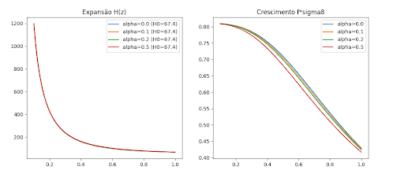

# TED-cosmology
This repository contains the code, data, and inference scripts for the TED cosmological model. The goal of this model is to provide a minimum phenomenological extension to $\Lambda$CDM, mitigating $H_0$ and $S_8$ tensions via late-time exponential dark energy decay.

## Visual Results

### Parameter Constraints (H0 vs S8)

### Growth of Structure

